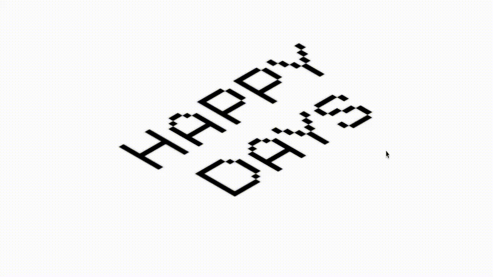

# 🌀 Peeling Letters Animation

> A Three.js experiment using GLSL shaders to create a distortion effect on a PNG image based on mouse proximity.

---

## 🖼 Preview




---

## ⚙️ Getting Started

This is a Vite-style JavaScript project using Three.js and custom vertex/fragment shaders.

### Run locally:

```bash
# 1. Clone this repo
git clone https://github.com/suzubu/peeling-letters-animation.git

# 2. Open index.html in a modern browser
open index.html
```

> No build tools required, but a local dev server is recommended if using modules.

---

## ✨ Features

- 🎯 Mouse-driven displacement distortion using GLSL shaders
- 🌌 Orthographic camera setup with plane-based rendering
- 🎭 PNG image layered with a blurred shadow using custom alpha blending
- 🛠 Real-time raycasting to drive displacement point
- 🧪 Smooth easing and mapping math functions inside shaders

---

## 💡 Dev Notes

- Uses `uDisplacement` uniform to pass interaction point into both shaders
- Main shader modifies vertex Z-position based on distance to cursor
- Shadow shader adjusts alpha to give soft edge highlight

---

## 📚 Inspiration / Credits

Inspired by:

- [Codepen @ Paola Demichelis](https://codepen.io/Paola-Demichelis-the-lessful/pen/ByaNGod)
- [Three.js Shader Demos](https://threejs.org/examples/#webgl_shader)
- [Patricio Gonzalez Vivo's GLSL functions](https://thebookofshaders.com)

---

## 🧪 Known Issues

- PNGs must be hosted or locally referenced correctly for texture loading to work
- Mobile interaction not yet optimized
- Performance may vary with image resolution and geometry segment count

---

## 🔭 Roadmap / TODO

- [ ] Add hover feedback for interactive areas
- [ ] Convert to WebGPU for experimental improvements
- [ ] Add GUI slider for displacement strength

---

## 📂 Folder Structure

```bash
shader-png-distortion/
├── index.html
├── src/
│   ├── main.js
│   └── style.css
├── public/
│   ├── Dark.png
│   └── Blurred.png
├── media/
│   └── peeling-demo.gif
└── README.md
```

---

## 📜 License

MIT — enjoy, remix, and credit appreciated.

---

## 🙋‍♀️ Author
Made with ☕ + 🎧 by [suzubu](https://github.com/suzubu) using Three.js and GLSL.
